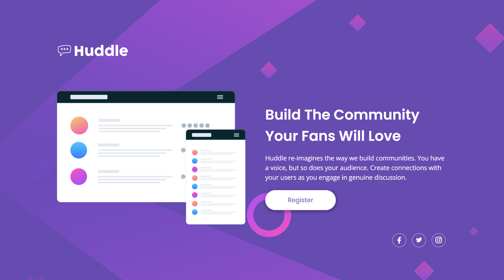

<h1>NFT Preview card component</h1>

 This is a Huddle landing page built as an exercise for advanced HTML and CSS practicing, proposed by the course DevQuest by <a href="https://github.com/devemdobro" target="_blank">Dev em Dobro</a>. The project is based in a challenge from <a href="https://www.frontendmentor.io/" target="_blank">Frontend Mentor</a>.

<h2>Overview</h2>

<h3>The project</h3>

The project consists of a landing page with a single introductory section. 
Users should be able to:

<ul>
    <li>View the optimal layout depending on their device's screen size;</li>
    <li>See hover states for interactive elements.</li>
</ul>

<h3>Screen preview</h3>
<h4>Desktop</h4>

<h4>Active states</h4>

<h4>Mobile</h4>

<h3>Links</h3>
<ul>
    <li>Live site URL: <a href="https://julianastahelin.github.io/huddle-landing-page/">https://julianastahelin.github.io/huddle-landing-page/</a></li>
    <li>Frontend Mentor Challenge: <a href="https://www.frontendmentor.io/challenges/huddle-landing-page-with-a-single-introductory-section-B_2Wvxgi0">https://www.frontendmentor.io/challenges/huddle-landing-page-with-a-single-introductory-section-B_2Wvxgi0</a></li>
    <li>Frontend Mentor - My solution: <a href="https://www.frontendmentor.io/solutions/solution-using-html-and-css-only--olW0nAOUO">https://www.frontendmentor.io/solutions/solution-using-html-and-css-only--olW0nAOUO</a></li>
    

</ul>

<h2>My process</h2>

<h3>Built with 👩🏽‍💻</h3> 
<ul>
    <li>HTML 5;</li>
    <li>CSS 3.</li>
</ul>

<h3>What I practiced 💪🏽</h3>
<ul>
    <li>Using CSS pseudo-elements;</li>
    <li>Using CSS display flex;</li>
    <li>Styling backgrounds;</li>
    <li>Using media queries for responsiveness.</li>
</ul>